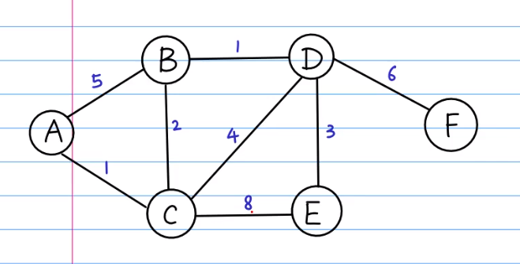

&copy; renyb

# Dijkstra

### 问题1：最短路径

#### 题目



```
# 代码构造上图

graph = {
    "A": {"B": 5, "C": 1},
    "B": {"A": 5, "C": 2, "D": 1},
    "C": {"A": 1, "B": 2, "D": 4, "E": 8},
    "D": {"B": 1, "C": 4, "E": 3, "F": 6},
    "E": {"C": 8, "D": 3},
    "F": {"D": 6}
}
```


#### Python

```python
# !/usr/bin/env python
# -*- coding: utf-8 -*-
# @Time    : 2020/07/27
# @Author  : renyb
# @File    : dijkstra.py

import heapq
import math


# 初始化各点距离值，起始点距离为0，其余点距离为正无穷大
def init_distance(graph, start):
    distance = {start: 0}
    for vertex in graph:
        if vertex != start:
            distance[vertex] = math.inf
    return distance


# 最短路径
def dijkstra(graph, start, end):

    # 记录未走过的点，使用优先队列维护，权重为起始点至当前节点的最短距离
    pqueue = []
    heapq.heappush(pqueue, (0, start))
    
    # 记录已经被走过的点，set()用于去重
    seen = set()
    
    # 记录当前节点的父节点，即从哪来的
    parent = {start: None}
    
    # 记录从起始点到各节点的最短距离
    distance = init_distance(graph, start)

    # 寻找起始点至所有点的最短路径
    while pqueue:
    
        # 从起始点开始走。队列非空时，拿出队列中权重最小的点
        pair = heapq.heappop(pqueue)
        dist = pair[0]
        vertex = pair[1]
        
        # 从队列中拿出的点，即认为被看见
        seen.add(vertex)

        # 从图中查看当前父节点的所有相邻子节点
        nodes = graph[vertex].keys()
        for node in nodes:
            if node not in seen:
                # 如果父节点到子节点的距离小于记录中的距离，则把子节点加入队列中，并更新子节点的距离值和子节点的父节点信息
                if dist + graph[vertex][node] < distance[node]:
                    heapq.heappush(pqueue, (dist + graph[vertex][node], node))
                    distance[node] = dist + graph[vertex][node]
                    parent[node] = vertex

    # 回溯最短路径
    path = [end]
    while parent[path[0]]:
        path.insert(0, parent[path[0]])

    return path, distance[end]


if __name__ == "__main__":

    graph = {
	    "A": {"B": 5, "C": 1},
	    "B": {"A": 5, "C": 2, "D": 1},
	    "C": {"A": 1, "B": 2, "D": 4, "E": 8},
	    "D": {"B": 1, "C": 4, "E": 3, "F": 6},
	    "E": {"C": 8, "D": 3},
	    "F": {"D": 6}
	}

    path, distance = dijkstra(graph, "A", "F")
    print(path)
    print(distance)
```

